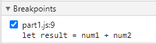
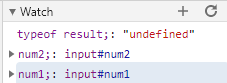
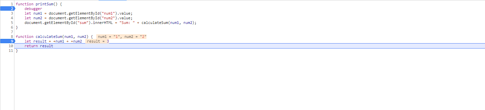

What was the problem?

The problem with the javascript was that when it gets the num elements from the HTML document, num1 and num2 are passed in as strings. This makes it so when the sum is calculated, it's concatenating two strings instead of taking the numeric sum. To fix this, we can just modify calculate sum to convert the two strings into numbers while summing them.

`let result = +num1 + +num2` would work.

